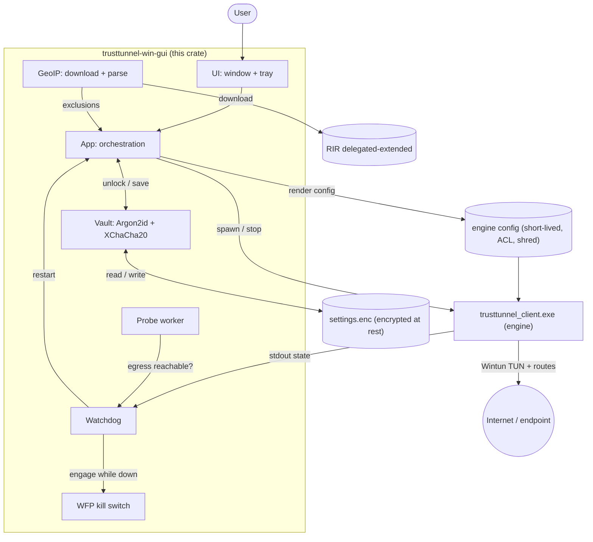

# trusttunnel-win-gui

Native Win32 tray GUI for the TrustTunnel VPN client, targeting Windows 7+.

It is a thin wrapper over the existing native engine
(`trusttunnel_client.exe` from the TrustTunnelClient repo): the GUI writes the
engine config and starts/stops the process. All TLS / TUN (Wintun) / routing is
done by the engine -- this app only provides a window, a tray icon, and an
optional geoip split-tunneling toggle.

## What it does

- Connect / Disconnect buttons and a tray icon (minimize/close hide to tray).
- Split-tunneling toggle (geoip): route one country DIRECT, everything else
  through the VPN. Implemented as `vpn_mode = "general"` + `exclusions = [country CIDRs]`
  in the engine config. Toggle OFF => full tunnel (no exclusions, no RIPE needed).
- Geoip list built the same way the Keenetic router does it: download the RIR
  delegated-extended file, filter by country + ipv4, convert address counts to
  CIDR prefixes. Cached locally; refreshed while connected.
- Auto-reconnect watchdog: detects a dead/stuck engine (from its stdout state
  plus an external egress probe) and restarts it, with a restart budget and
  fatal-error detection (no infinite loop on bad creds/cert).
- Encrypted settings at rest (passphrase, Argon2id + XChaCha20-Poly1305) and a
  WFP fail-closed kill switch engaged while the tunnel is down.

## Architecture



Modules (portable = builds/tested off Windows; win = Windows-only):

- `src/config.rs` (portable) -- settings model + paths (settings.enc, engine config, geoip cache).
- `src/secret.rs` (portable) -- `Vault`: passphrase encryption (Argon2id + XChaCha20-Poly1305).
- `src/toml_writer.rs` (portable) -- render engine config (mode general + exclusions) + atomic write.
- `src/import.rs` (portable) -- import an exported `trusttunnel_client.toml`.
- `src/geoip/` (portable) -- RIR download + parse + `count_to_prefix` + cache.
- `src/engine.rs` -- spawn/stop the engine, stdout channel, PID file + adopt.
- `src/engine_state.rs` (portable) -- engine stdout -> connection state.
- `src/probe.rs` (portable) -- background external egress probe.
- `src/watchdog.rs` (portable) -- reconnect decision (desired-vs-actual, budget, fatal detection).
- `src/killswitch.rs` + `src/win/wfp.rs` (win) -- WFP fail-closed kill switch.
- `src/shred.rs` (portable) -- best-effort secure delete.
- `src/app.rs` -- orchestration (connect / disconnect / toggle / refresh / watchdog tick).
- `src/ui/` (win) -- Win32 window, tray, settings/password dialogs (windows-rs).
- `src/win/` (win) -- `proc` (pid verify + single-instance), `wfp`, `acl`.
- `manifest/` + `assets/app.ico` -- app.manifest (requireAdministrator, Win7..11, Common-Controls v6), dialogs, icon.

## Why these choices

- Engine reused, not rewritten: the DPI-resistant protocol stack (HTTP/2, QUIC,
  pinger, killswitch, PQ crypto) already exists and already builds for Windows
  (`platform/windows/vpn_easy`, `net/src/os_tunnel_win.cpp`).
- Native Win32, not egui: Windows 7 has no DX12 and OpenGL depends on GPU
  drivers that a work PC may lack. Win32 is boring but always runs.
- Split tunneling must be toggleable OFF: the RIR host may be unreachable
  without the VPN, and full tunnel is the safe default. Refresh geoip while
  connected so the (possibly blocked) RIR host is reachable through the tunnel.

## Windows 7 notes

- Wintun's driver is SHA-2 signed; Windows 7 needs update KB4474419 to load it.
- TLS: uses `ureq` + `rustls` (pure Rust) on purpose -- a bare Win7 SChannel may
  lack TLS 1.2, which would break HTTPS to the RIR host.
- Ship `trusttunnel_client.exe` (and `wintun.dll` matching the arch) next to the
  GUI, or set the engine path in settings.
- Requires administrator (manifest) for TUN.

## Build

The `windows` crate compiles only for Windows targets. On the dev machine
(macOS/Linux) the portable modules are still testable:

```
cargo test                          # crypto / geoip / watchdog / toml unit tests
```

Native build on Windows:

```
cargo build --release --target x86_64-pc-windows-msvc
```

Cross-build from macOS/Linux (GNU target, no C linker fuss beyond mingw):

```
brew install mingw-w64                       # or the distro package
rustup target add x86_64-pc-windows-gnu
# .cargo/config.toml sets linker = x86_64-w64-mingw32-gcc
export CC_x86_64_pc_windows_gnu=x86_64-w64-mingw32-gcc
export AR_x86_64_pc_windows_gnu=x86_64-w64-mingw32-ar
cargo build --release --target x86_64-pc-windows-gnu
# quick type-check of the Windows-only code without linking:
cargo check --target x86_64-pc-windows-gnu
```

Match the engine/wintun architecture (x86_64 vs i686) to the target OS. See the
TrustTunnelClient Bamboo specs for the reference Windows toolchain.

## Status

Feature-complete and cross-builds to a `.exe`; the portable core has 27 unit
tests and the Windows-only layers (UI/tray/WFP/ACL/proc) are verified by
cross-compilation. Not yet validated on real hardware: the password flow,
WFP leak-blocking, the engine-config ACL, Wintun (needs KB4474419), and the
Windows 7 toolchain/runtime.
